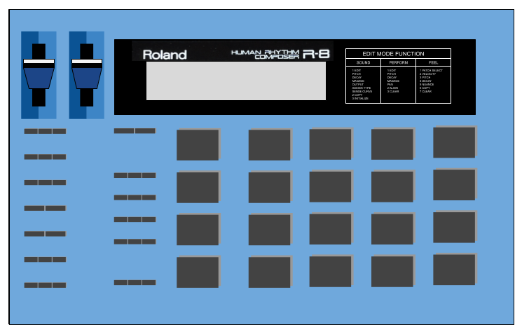

# Drummer

An demo that allows drum sequences to be composed and saved in a web interface.

[LIVE DEMO](https://glynnbird.github.io/drummer/)

The drum sounds are based on the Roland CR78 & R8 drum machines but are programmed using HTML check box
controls on a time line.

The drum patterns can be saved and retrieved in an in-browser database [PouchDB](https://pouchdb.com)
and synced with remote CouchDB or Cloudant databases.

## Credits

Thanks to http://www.boxedear.com/free.html for the original samples.
