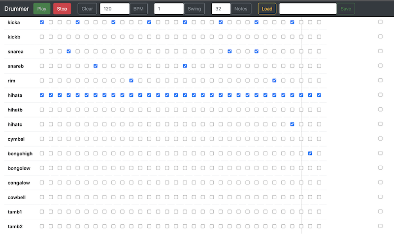

# Drummer

An demo that allows drum sequences to be composed and saved in a web interface.

[LIVE DEMO](https://glynnbird.github.io/drummer/)

The drum sounds are based on the Roland CR78, R8 & Tempest drum machines but are programmed using HTML check box
controls on a time line.

It is built with the [Howler JavaScript audio library](https://howlerjs.com/) and brought to life with [Vue.js](https://vuejs.org/). 

## Credits

Thanks to http://www.boxedear.com/free.html for the original samples.
